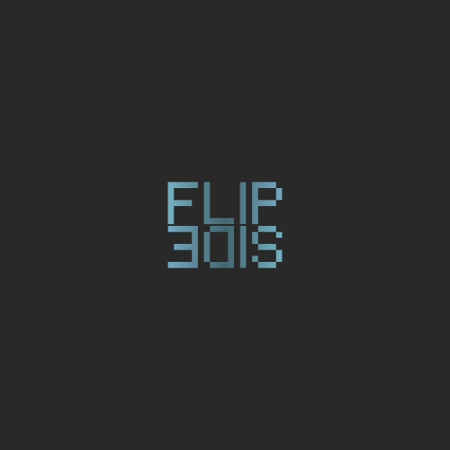

# Flip Side 📼

**Flip Side** is a retro-styled voice game where you challenge yourself to speak in reverse!

## 🎮 How to Play

1.  **Record**: Say a short phrase (e.g., "Hello World").
2.  **Listen**: Hear it played back in reverse (e.g., "dlroW olleH").
3.  **Mimic**: Try to record yourself saying the *reversed* phrase.
4.  **Flip It**: Play your attempt in reverse. If you did it right, it should sound like the original English phrase!

## ✨ Features

- **Retro Aesthetic**: Pixel-perfect design inspired by cassette tapes and analog gear.
- **Reverse Audio Engine**: Instant audio reversal using the Web Audio API.
- **Visual Feedback**: Circular recording timer and glassmorphism UI.
- **Dark/Light Mode**: Switch between "Night Studio" and "Daylight" themes.

## 🚀 Quick Start

Simply open `index.html` in any modern web browser. No installation required!

## 🛠️ Technologies

- HTML5
- CSS3 (Variables, Flexbox, Grid)
- Vanilla JavaScript (ES6+)
- Web Audio API
- MediaRecorder API

## 📄 License

This project is licensed under the MIT License - see the [LICENSE](LICENSE) file for details.
